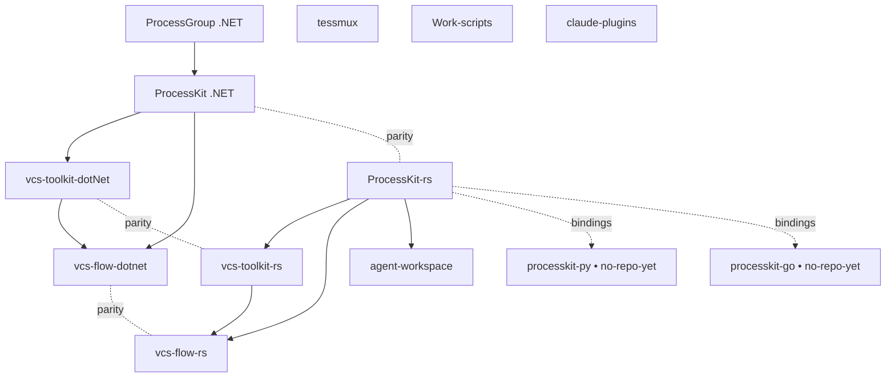

# Граф зависимостей и порядок сборки

Кто на кого опирается среди персональных репо. Определяет **порядок сборки** и то, какие
кросс-репо изменения обязаны идти строго после каких (фундамент → потребители).

## Диаграмма

## Порядок сборки

**Линия .NET (снизу вверх):**
1. `ProcessGroup` (фундамент: lifetime процессов)
2. `ProcessKit` (runner поверх ProcessGroup)
3. `vcs-toolkit-dotNet` (Git/jj/GitHub поверх ProcessKit)
4. `vcs-flow-dotnet` (workflow-команды поверх toolkit + ProcessKit)

**Линия Rust (снизу вверх):**
1. `ProcessKit-rs` (фундамент: async process management; вытеснил внутренний `vcs-process`)
2. `vcs-toolkit-rs` (Git/jj/GitHub/GitLab/Gitea поверх processkit) и `agent-workspace` (поверх processkit)
3. `vcs-flow-rs` (TUI workflow поверх vcs-toolkit-rs + processkit)

**Будущие (no-repo-yet):** `processkit-py`, `processkit-go` — тонкие биндинги к ядру `processkit` (Rust),
не реимплементации. Пиннят точную версию crate.

**Независимые** (вне графа зависимостей): `tessmux`, `Work-scripts`, `claude-plugins`.

## Следствия для кросс-репо изменений

- Изменение публичного API **фундамента** (`ProcessGroup`, `ProcessKit`, `ProcessKit-rs`)
  → задачи у потребителей **строго после** (`depends-on`), вверх по стрелкам.
- **Пары `-rs`/`.NET`** держат паритет фич: значимое изменение в одной — повод завести
  зеркальную идею/задачу во второй (см. `ownership.md`).
- Биндинги (`-py`/`-go`) пиннят версию `processkit` (Rust) и следуют за ней осознанно, не транзитивно.
