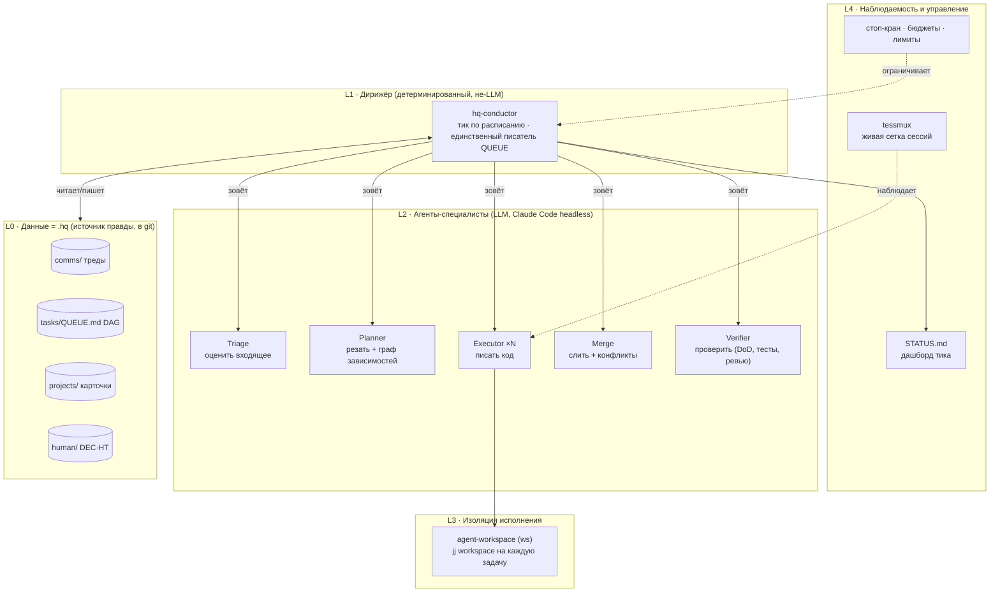
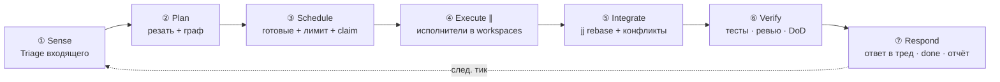
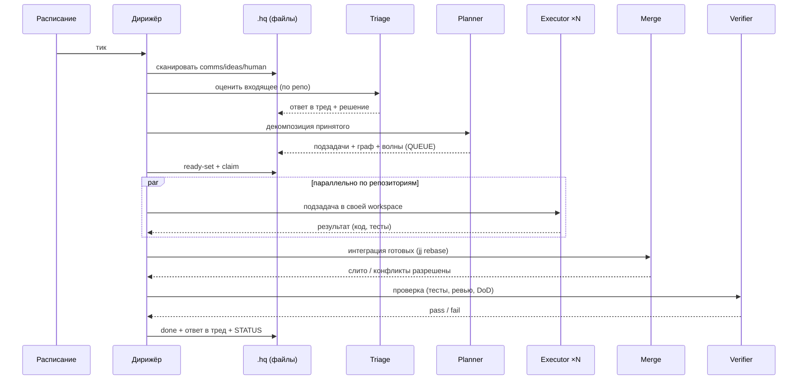
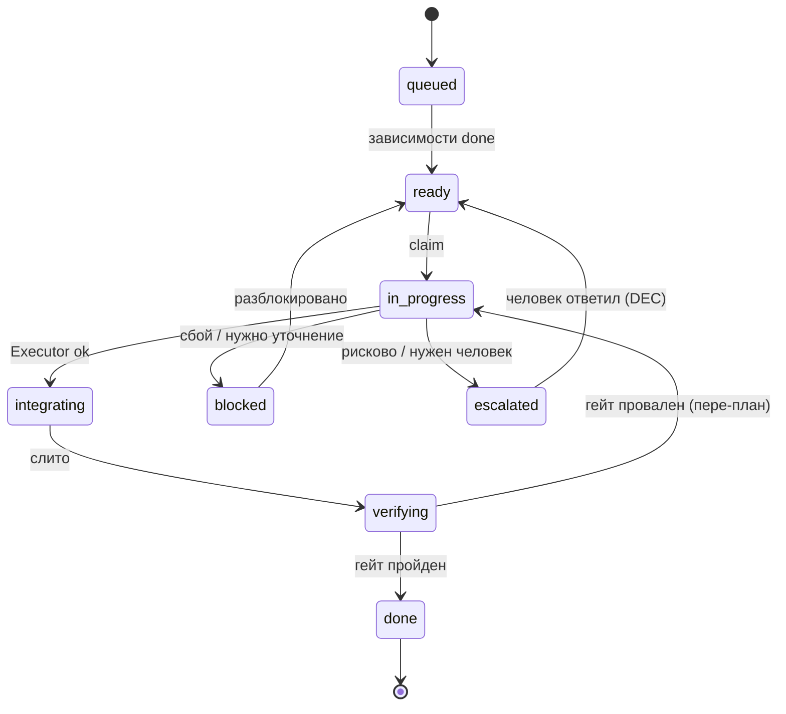
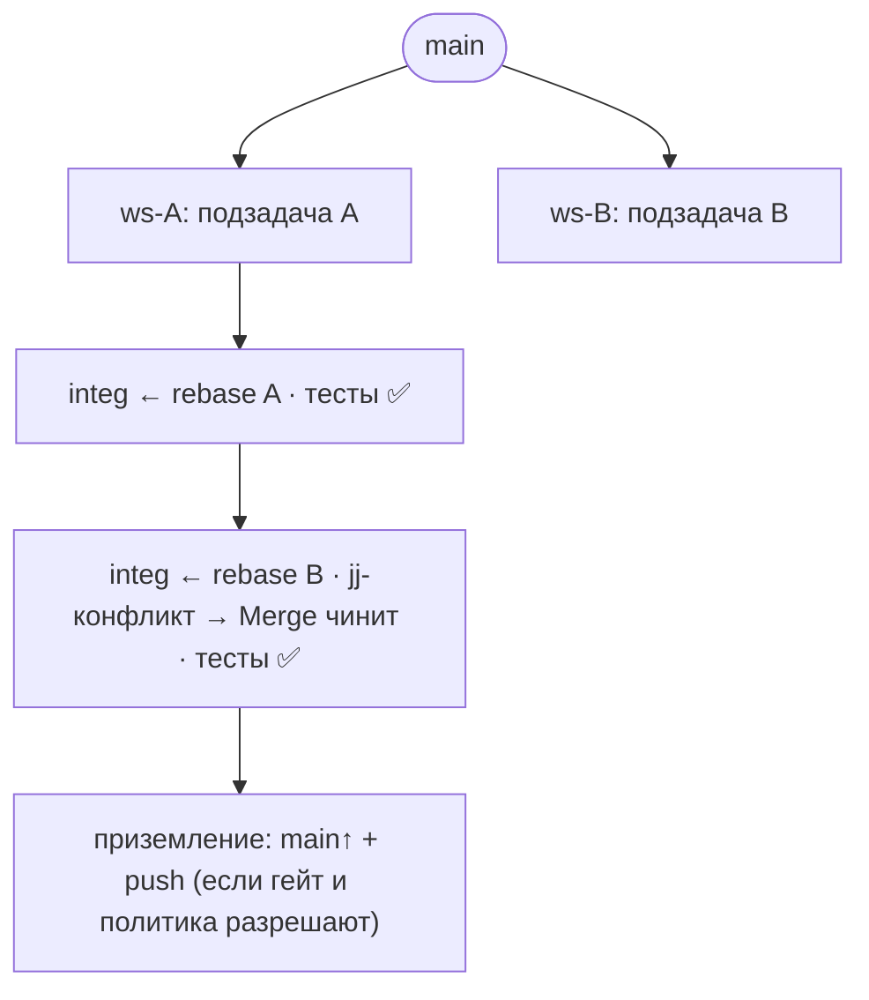
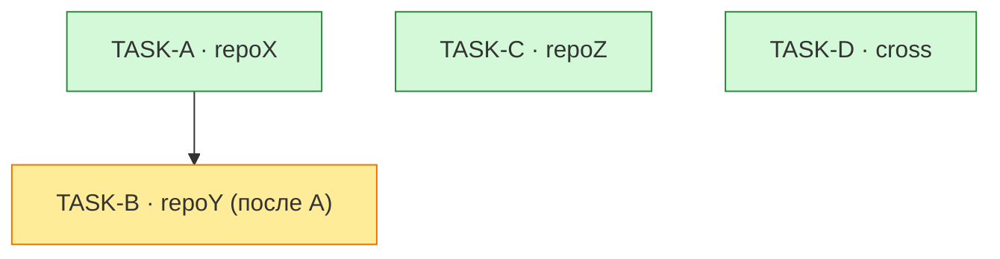

# Оркестр агентов `.hq` — как это устроено

Простое описание того, как набор агентов будет **сам** разбирать входящую коммуникацию в
`.hq`, превращать её в задачи, выполнять их параллельно в изолированных рабочих копиях,
сливать результат, разрешать конфликты и отмечать сделанное.

> Это «как работает» на простом языке + схемы. Поэтапный путь — в [`ROADMAP.md`](ROADMAP.md).
> Детальный план реализации каждого пункта — в [`IMPLEMENTATION.md`](IMPLEMENTATION.md).
> Почему именно так (раунды генерация→критика) — в [`RATIONALE.md`](RATIONALE.md).

---

## 1. Идея в одном абзаце

Раз в N минут просыпается **Дирижёр** (детерминированная программа — без «фантазии»). Он
смотрит, что нового пришло в `.hq/comms` (и принятые идеи, и ответы человека), и зовёт
**агентов-специалистов** (это уже LLM): один оценивает входящее, другой режет работу на
подзадачи и строит граф зависимостей, несколько — параллельно пишут код в **отдельных
рабочих копиях**, ещё один — сливает и разрешает конфликты, ещё один — проверяет. Дирижёр
не пишет код сам: он только раздаёт работу, следит за порядком, гейтами и безопасностью, и
обновляет состояние в `.hq`. Когда задача прошла проверку — она помечается выполненной, а в
исходный тред пишется ответ.

## 2. Пять принципов, на которых всё держится

1. **Входящее — это предложения, а не команды.** Агент репозитория сам решает: делать,
   не делать, как делать. (Уже зашито в протокол `.hq`.)
2. **Дирижёр детерминированный, агенты — умные.** Скучную логику (что готово, что за чем,
   кого запускать, в каком порядке сливать) делает программа по чётким правилам. Суждения
   (оценить, спланировать, написать, разрешить конфликт) делает LLM. Не смешиваем.
3. **Сначала параллелим МЕЖДУ репозиториями, а не внутри.** Две задачи в разных репозиториях
   физически не могут конфликтовать. Внутри одного репозитория — там и живут конфликты —
   сначала выполняем по очереди, а настоящий внутри-репо параллелизм добавляем позже и осторожно.
4. **Слияние — через jj, инкрементально.** Jujutsu умеет хранить конфликты, **не блокируя**
   работу. Поэтому готовые подзадачи по одной «нанизываются» (rebase) на общую интеграционную
   ревизию; конфликт всплывает рано и маленьким, его чинит отдельный агент, и только после
   зелёных тестов изменение «приземляется».
5. **Человек на ручке громкости.** Уровень автономии — это диск (dial): от «только предложить,
   приземляет человек» до «низкорисковое приземляем сами, рисковое — спрашиваем». Есть стоп-кран,
   бюджеты и откат.

## 3. Архитектура (слои)



- **L0 — Данные (`.hq`).** Всё состояние — файлы в git: треды (`comms`), очередь с графом
  (`tasks/QUEUE.md`), карточки репозиториев (`projects`), решения/задачи для человека (`human`).
  Это и хранилище, и «шина сообщений». Версионируется → есть история и откат.
- **L1 — Дирижёр.** Один процесс, который тикает по расписанию. **Единственный, кто пишет**
  очередь и статусы (чтобы не было гонок). Сам код не трогает.
- **L2 — Агенты-специалисты.** LLM-агенты с узкой ролью и чётким входом/выходом (JSON).
  Без состояния между вызовами — всё состояние в `.hq`.
- **L3 — Изоляция.** Каждый Executor работает в своей jj-workspace (через `agent-workspace`),
  поэтому параллельные исполнители не топчут рабочую копию друг друга.
- **L4 — Наблюдаемость/управление.** `tessmux` — видеть живые сессии; `STATUS.md` — сводка
  тика; стоп-кран и бюджеты — чтобы ничего не «убежало».

## 4. Кто есть кто (роли)

| Роль | Тип | Что делает | Вход → Выход |
|---|---|---|---|
| **Дирижёр** (`hq-conductor`) | программа | тикает, сканирует, считает готовность по графу, клеймит, запускает исполнителей с лимитом, ведёт порядок слияния, гейты, обновляет `.hq`, логирует | расписание + `.hq` → действия + STATUS |
| **Triage** | LLM | оценивает входящий тред/идею **с позиции репо-владельца** | 1 входящий + карточка/ownership → `{accept\|reject\|clarify\|escalate}` + ответ в тред |
| **Planner** | LLM | режет принятую работу на подзадачи, строит граф (только-после) и помечает параллельно-безопасные | seed + карточки + dependency-graph → спеки подзадач + строки QUEUE + волны |
| **Executor** ×N | LLM | в своей workspace пишет код одной подзадачи, собирает, гоняет тесты, коммитит (jj) | спека + workspace + стандарты репо → `{status, diff, тесты, follow-ups}` |
| **Merge** | LLM+прог. | нанизывает готовые изменения на интеграционную ревизию, разрешает jj-конфликты | изменения + конфликты jj → `{integrated, resolved, тесты, needs-human}` |
| **Verifier** | LLM | состязательная проверка против DoD и стандартов (переиспользует `code-review`/`security-review`) | интегрированное изменение → `{pass\|fail, находки}` |

## 5. Что происходит за один тик



1. **Sense.** Найти в `comms` треды, где `awaiting` = репо (и не обработанные), принятые идеи,
   ответы человека. По каждому — Triage с позиции владельца репо. Консервативно.
2. **Plan.** Принятое — на подзадачи; каждой — репо и **объявленную область** (файлы/модуль);
   граф зависимостей (только-после) и параллельно-безопасные множества (по непересечению области).
3. **Schedule.** Дирижёр считает «готовые» (зависимости done, не заблокировано, не ждёт человека),
   с лимитом параллелизма и проверкой непересечения, клеймит (`in-progress` + `assigned-to`),
   выдаёт каждой workspace.
4. **Execute.** Исполнители параллельно делают своё в изоляции, собирают, тестируют, коммитят,
   возвращают структурированный результат.
5. **Integrate.** Готовые — по одному rebase на интеграционную ревизию; jj фиксирует конфликты
   не блокируя; Merge их разрешает; после каждого — сборка/тесты.
6. **Verify.** Гейт: тесты + линт + (опц.) ревью-агент против DoD.
7. **Respond.** Ответ в исходный тред (принято/сделано/итог), статус → done, архив, обновить
   QUEUE/STATUS, при необходимости — человеку. И снова тик.

### Тот же тик как последовательность



## 6. Жизненный цикл задачи



## 7. Параллелизм и слияние

**Между репозиториями — бесплатно.** Разные репозитории — разные рабочие деревья; конфликтов
нет в принципе. Это основной источник параллелизма на старте.

**Внутри репозитория — через jj, инкрементально.** Каждая готовая подзадача нанизывается на
общую интеграционную ревизию; jj хранит конфликт, не блокируя; Merge-агент чинит по одному;
после каждого — тесты. «Большого взрыва» слияния нет — конфликты мелкие и ранние.



Почему jj, а не git: в git конфликт **блокирует** дерево и требует немедленного ручного
разрешения; в jj конфликт — это просто состояние ревизии, работа продолжается, а разрешение
можно сделать отдельным шагом отдельным агентом. Для оркестра из многих агентов это решающее.

## 8. Зависимости и волны

Граф «только-после» + параллельно-безопасные множества живут в `tasks/QUEUE.md`. Дирижёр идёт
волнами: внутри волны — параллельно; следующая волна стартует, когда зависимости предыдущей `done`.
Межрепозиторный порядок берётся из `knowledge/dependency-graph.md` (например, потребитель —
строго после фундамента).


*Волна 1 (зелёные): A, C, D — параллельно. Волна 2 (жёлтое): B — после A.*

## 9. Человек в контуре и безопасность

- **Диск автономии.** Старт: «оркестр предлагает и готовит, приземляет человек». Дальше:
  «низкий риск приземляем сами, высокий — `DEC` человеку». Уровень настраивается per-repo.
- **Гейты.** Тесты обязаны быть зелёными; рисковые изменения → `human/DEC`; ручные действия
  (секреты, права) → `human/HT`.
- **Стоп-кран и бюджеты.** Лимит параллельных агентов, таймауты (processkit), потолок токенов/итераций,
  ручной стоп. Зацикливание/мусор → `jj abandon`, задача → `blocked`, эскалация.
- **Откат.** Всё в jj/git: `jj undo`, `jj abandon`, `jj op restore`. Любое приземление обратимо.
- **Единственный писатель.** Очередь/статусы пишет только Дирижёр; исполнители пишут лишь свою
  workspace и файл-результат — нет гонок.

## 10. На чём построено (догфудинг своего стека)

Оркестр собирается из **твоих же** проектов — он одновременно и инструмент, и витрина/драйвер их развития.

| Возможность | Инструмент |
|---|---|
| Изоляция исполнителя (worktree/workspace, авто-merge) | **agent-workspace** (`ws`) |
| Запуск/надзор/лимиты/отмена/запись агент-процессов | **processkit / ProcessKit-rs** |
| Типизированные git/jj/GitHub операции (fetch, rebase, push, PR, merge, конфликты) | **vcs-toolkit-rs / -dotNet** (+ `vcs-mcp`) |
| Готовые workflow commit/push | **vcs-flow-rs / -dotnet** |
| Живая сетка параллельных сессий, видимость/управление | **tessmux** |
| Сами LLM-агенты | **Claude Code headless** (`claude -p`) / Agent SDK |
| Данные, очередь, протокол | **`.hq`** |

## 11. Где что лежит

```
.hq/orchestrator/
├── README.md          ← этот файл (как работает + схемы)
├── ROADMAP.md         ← фазы 0–6 (crawl→walk→run)
├── IMPLEMENTATION.md  ← детальный план: контракты агентов, состояние, интеграция, риски
└── RATIONALE.md       ← раунды генерация→критика, альтернативы, решения
```
Рабочее состояние оркестра — в существующих папках `.hq`: `comms/`, `tasks/QUEUE.md`, `projects/`,
`human/`, плюс будущие `tasks/_runs/` (логи тиков) и `orchestrator/STATUS.md` (дашборд).
