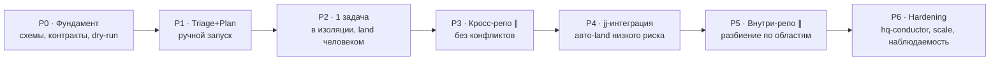

# ROADMAP — оркестр агентов `.hq`

Путь **crawl → walk → run**: от ручного триажа до автономного параллельного исполнения с
самослиянием. Каждая фаза самостоятельно полезна, даёт работающий результат и снижает риск
следующей. Принцип: **наращиваем автономию и параллелизм только после того, как предыдущий
уровень доказал надёжность** (зелёные тесты, низкий процент эскалаций/откатов).

Общая картина и схемы — [`README.md`](README.md). Как делать каждую фазу — [`IMPLEMENTATION.md`](IMPLEMENTATION.md).

| Фаза | Цель | Автоматизировано | Человек | Параллелизм | Усилие | Гл. риск |
|---|---|---|---|---|---|---|
| **P0** | Фундамент: форматы, контракты, dry-run | — | всё | — | S | недо-специфицировать |
| **P1** | Триаж входящего + планирование задач | sense+plan | execute, land | — | M | качество триажа/плана |
| **P2** | Исполнение 1 задачи в изоляции | +execute(1) | review, land | — | M | LLM-код, изоляция |
| **P3** | Параллель между репозиториями | +scheduler, ∥ | land (гейт) | межрепо | L | надзор, бюджеты |
| **P4** | jj-интеграция + авто-land низкого риска | +merge, +verify, land(low) | DEC(high) | межрепо | L | слияние, автономия |
| **P5** | Параллель внутри репозитория | +file-scope split | DEC спорного | внутри-репо | L–XL | конфликты |
| **P6** | Hardening, масштаб, наблюдаемость | всё + recovery | надзор | полный | XL | надёжность 24/7 |

---

## P0 — Фундамент *(S, блокирующая)*

**Цель.** Зафиксировать «контракты» так, чтобы дальше всё стыковалось без переделок.
**Делаем.**
- Состояние и схемы: формат файла-результата исполнителя, журнала тика (`tasks/_runs/`),
  дашборда `orchestrator/STATUS.md`, поля claim (`assigned-to`, `claimed-at`, `lease`).
- Контракт Дирижёра (псевдокод тика) и правило **единственного писателя** + файловые локи.
- `--dry-run`: прогон без записи и без запуска агентов (печатает план действий).
- Уровень автономии per-repo в `projects/<repo>/card.md` (поле `autonomy: propose|assist|auto-low`).

**Exit.** Есть документированные схемы + пустой Дирижёр-скелет, который в dry-run печатает,
что бы он сделал на текущем `.hq`, ничего не меняя.

## P1 — Триаж + планирование (ручной запуск) *(M)*

**Цель.** Доказать, что агенты хорошо **оценивают** входящее и **режут** на корректный граф —
без риска исполнения.
**Делаем.**
- Агенты `Triage` и `Planner` как Claude Code **skills** (промпт + JSON-вход/выход).
- Дирижёр-скрипт `sense` + `plan`: сканирует `comms`, зовёт Triage, для принятого зовёт Planner,
  пишет ответы в треды + строки в `QUEUE.md` + волны. Запуск **вручную**.
- **Догфуд:** прогнать на реальном треде `T-20260609-vcs-processkit-feedback` (vcs-toolkit-rs→ProcessKit-rs).

**Exit.** На реальном треде получены: корректный ответ-оценка + 1–3 задачи в QUEUE с верным
графом зависимостей; человек подтверждает качество. Исполняет/land человек.

## P2 — Исполнение одной задачи в изоляции *(M)*

**Цель.** Доказать безопасное исполнение одной подзадачи изолированно.
**Делаем.**
- Агент `Executor` (skill/headless). Дирижёр берёт ОДНУ `ready`-задачу, заводит jj-workspace
  через `ws`, запускает исполнителя, собирает структурированный результат.
- Сборка/тесты по командам из `projects/<repo>/card.md`. Результат + diff на ревью человеку.
- Откат: `jj abandon` при провале; задача → `blocked`/`done` вручную.

**Exit.** Реальная подзадача выполнена в отдельной workspace, тесты зелёные, человек заland-ил;
рабочая копия основного репо не затронута.

## P3 — Параллель между репозиториями (без конфликтов) *(L)*

**Цель.** Несколько готовых задач в **разных** репозиториях — параллельно за один тик.
**Делаем.**
- `Scheduler` внутри Дирижёра: ready-set из графа, лимит параллелизма, claim, по workspace на задачу.
- Запуск/надзор исполнителей через **processkit** (конкурентность, таймауты, отмена).
- **tessmux** — живой обзор сессий. Гейт тестов перед предложением land. Land — человек.

**Exit.** ≥2 кросс-репо задачи выполнены параллельно в одном тике, обе с зелёными тестами,
с лимитом и таймаутами; виден прогресс.

## P4 — jj-интеграция + авто-land низкого риска *(L)*

**Цель.** Автоматическое слияние и приземление безопасного; рисковое — человеку.
**Делаем.**
- `Merge`-агент + инкрементальный rebase на интеграционную ревизию (jj-конфликты не блокируют).
- `Verifier`-агент (переиспользовать `code-review`/`security-review`) как гейт против DoD.
- **Диск автономии**: `auto-low` → авто-land после зелёного гейта; иначе `DEC` человеку.
  Для прямого-в-main стиля: `main↑ + push` через vcs-toolkit; политику land берём из карточки.

**Exit.** Одна волна низкого риска авто-приземлена безопасно (тесты+ревью); одна рисковая —
корректно эскалирована в `DEC`; есть откат на провале гейта.

## P5 — Параллель внутри одного репозитория *(L–XL)*

**Цель.** Самое сложное: параллельные подзадачи в одном репо без «конфликтных штормов».
**Делаем.**
- `Planner` объявляет **область** каждой подзадачи (файлы/каталоги/модуль) и метит
  параллельно-безопасными только при непересечении (+ нет общего публичного API). Сомнение → только-после.
- Параллельные workspaces на одном репо; интеграция rebase по одной; `Merge` чинит jj-конфликты;
  тесты после каждой.
- Стресс-тест: специально пересекающиеся подзадачи должны **сериализоваться**, непересекающиеся — слиться.

**Exit.** 2 непересекающиеся подзадачи одного репо слиты параллельно начисто; пересекающаяся
пара корректно выполнена по очереди; процент конфликтов и откатов в норме.

## P6 — Hardening, масштаб, наблюдаемость *(XL)*

**Цель.** Надёжная безнадзорная работа.
**Делаем.**
- `hq-conductor` как Rust-бинарь (догфуд **processkit** + **vcs-toolkit-rs** + **agent-workspace**):
  устойчивый планировщик, лизы/claim, восстановление после краша (состояние из `.hq`).
- **tessmux**-дашборд, метрики (пропускная способность, % конфликтов/эскалаций/зелёных тестов, % автономии),
  бюджеты, record/replay-тесты тиков (processkit), полные режимы автономии per-repo.

**Exit.** Несколько тиков подряд без присмотра с восстановлением после сбоя; дашборд и метрики;
воспроизводимые прогоны в тестах.

---

## Сквозные правила перехода между фазами
- Не повышаем автономию/параллелизм, пока метрики предыдущей фазы не «зелёные» (тесты, эскалации, откаты).
- Каждая фаза — это и набор задач в самом `.hq` (мета-догфуд): фазы можно завести как `TASK-####`
  с зависимостями (P(n) только-после P(n-1)).
- Любая фаза включаема/выключаема диском автономии — можно остановиться на P3 надолго, это полноценный режим.
